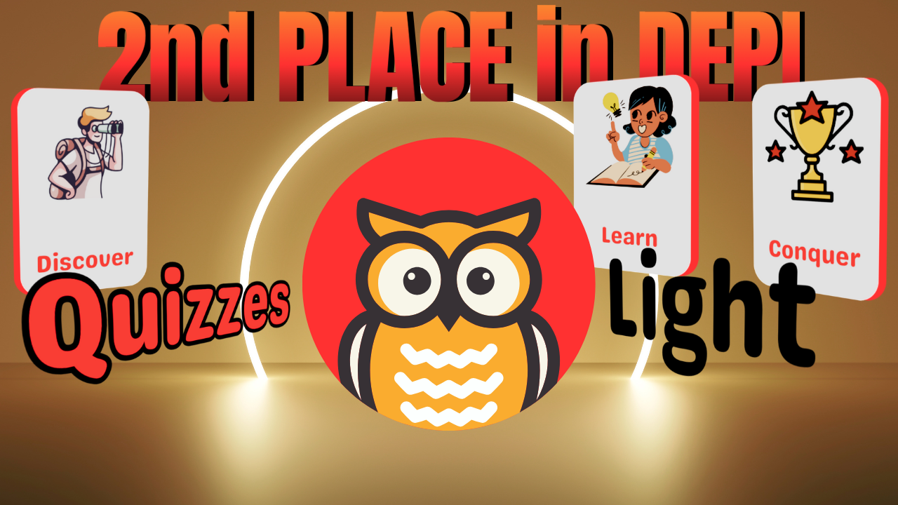
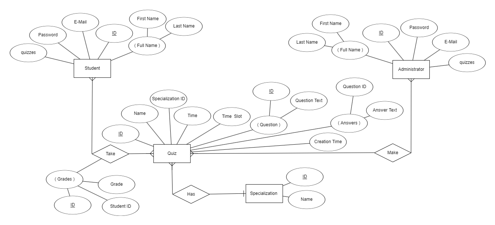

<div style="text-align:center" align="center">

</div>

## 1. Introduction

The **<span style="color:#ff3131">Quizzes</span> Light** Platform is a <span style="color:#ff3131">**Laravel-based**</span> application designed using the **<span style="color:#ff3131">MVC architecture</span>** that allows admins to create and manage quizzes, while students can participate in them. The platform is built with two distinct guards for authentication: admin and student. Each role has its own specific permissions and responsibilities within the system.

## 2. Used Technologies

### Front-End:

-   HTML (Laravel Blade)
-   CSS
-   JavaScript
-   Font Awesome Library

### Back-End:

-   PHP
-   MySQL
-   Laravel

## 3. Prerequisites

Before running the application, ensure you have the following installed:

-   PHP 8.2 or higher
-   PHP package manager (Composer)
-   Laravel 11.x
-   MySQL or phpMyAdmin DataBase
-   Web Server (ex: Apache, Tomcat, Nginx)
-   All in one solutions (ex: XAMPP, Laragon, Laravel Herd)
-   Font Awesome Library

## 4. Installation and Set The Project Environment

To set up the project, follow these steps:

1- Clone the repository:

```Bash
git clone <repository-url>
Cd Quizzes-Light
```

2- Install dependencies:

```Bash
composer install
```

3- Create a **<span style="color:#ff3131">.env</span>** file:

Make sure you set the **<span style="color:#ff3131">.env</span>** file in your project environment to make the necessary Configuration.

4- Run migrations and seed the database:

```Bash
php artisan migrate --seed
```

5- Start the development server: (If you do not make a [virtual host](https://httpd.apache.org/docs/2.4/vhosts/))

```Bash
php artisan serve
```

## 5- Configuration

The **<span style="color:#ff3131">.env</span>** file should be configured with the following:

-   **APP_URL:** The URL where your app will be hosted.
-   **DB_CONNECTION, DB_HOST, DB_PORT, DB_DATABASE, DB_USERNAME, DB_PASSWORD: Database configuration.**

## 6- User Authentication

The app uses two authentication guards: **<span style="color:#ff3131">admin</span>** and **<span style="color:#ff3131">student</span>**. Each guard enters their credentials through a dedicated URL to prevent unauthorized access.

### Admin Guard:

-   **Role:** Manages quizzes, and questions, and monitors student progress.
-   **Access:** Admins can access the admin dashboard, where they can create, update, and delete quizzes.
-   **Configuration:** The **<span style="color:#ff3131">config/auth.php</span>** file is set up with an **<span style="color:#ff3131">admin</span>** guard, using the **<span style="color:#ff3131">admin's</span>** table for authentication.

### Student Guard:

-   **Role:** Takes quizzes and views their scores.
-   **Access:** Students can log in to access quizzes assigned to them and submit their answers.
-   **Configuration:** The **<span style="color:#ff3131">config/auth.php</span>** file includes a **<span style="color:#ff3131">student</span>** guard, using the **<span style="color:#ff3131">student’s</span>** table for authentication.

## 7- Features

### Admin Features:

-   **Create, Read, Update, and Delete (CRUD) Operations:**
    -   **Manage quizzes:** Admins can add, edit, and remove quizzes.
    -   **Manage questions:** Admins can add questions to quizzes, set answer choices, and specify the correct answer.
-   **View Student Results:** Monitor student scores and quiz completion statuses.

### Student Features:

-   **Participate in Quizzes:** Students can take quizzes assigned to them.
-   **View Scores:** Students can see their results for each quiz.

### Quiz Page:

The quiz page in **<span style="color:#ff3131">Quizzes</span> Light** is designed to provide a seamless and engaging user experience while maintaining functionality and reliability. Key features include:

-   **User-Friendly Interface:** The quiz page boasts a clean and intuitive layout that ensures ease of use. Each question is displayed prominently with clearly defined answer options, making it accessible to users of all levels.
-   **Integrated Timer:** A dynamic timer is embedded on the quiz page to track the remaining time for the quiz. The timer ensures users stay aware of their time limits.
-   **Time Warning Alert:** When the quiz timer reaches the last minute, it changes color to red, visually alerting the user that they are running out of time. This feature helps maintain focus and urgency.
-   **Auto-Submit Functionality:** If the timer runs out, the quiz page automatically submits the user's answers. This ensures that all completed work is captured, even if the user is unable to submit manually.
-   **Responsive Design:** The page is fully responsive, ensuring a consistent experience across devices of all sizes, from desktops to mobile phones.

### Auto correcting:

-   **<span style="color:#ff3131">Quizzes</span> Light** features a **secure auto-correcting system implemented in the <span style="color:#ff3131">back-end logic</span>**, ensuring accurate result evaluation while adhering to security best practices by avoiding client-side processing.

## 8- Database Schema

The application uses two main tables for authentication: **<span style="color:#ff3131">Admins and Students Tables</span>** and other tables for quiz management:

-   **Admins Table:** Stores admin details for authentication.
-   **Students Table:** Stores student details for authentication.
-   **Quizzes Table:** Contains information about each quiz (e.g., name, time, questions).
-   **Specializations Table:** Stores all the available specializations for quizzes.

<div style="text-align:center; border-radius:10px">

</div>

## 9- Tutorial Video

Explore the seamless user experience of **<span style="color:#ff3131">Quizzes</span> Light** in this tutorial video. It highlights the **application's clean and intuitive design**, showcasing its **responsive layout** that adapts flawlessly across devices. The video also demonstrates core functionalities, including **quiz creation, real-time auto-correction, and student performance tracking**. See how every detail is optimized for efficiency, usability, and a secure user environment.

-   [Quizzes Light Tutorial Video On YouTube](https://youtu.be/Fl7HAK1M_2Q)

## 10- Assets

-   [Quizzes Light Presentation](https://www.canva.com/design/DAGTz0vzHB0/XhTkaWoBonUuTzqjxw2guA/edit?utm_content=DAGTz0vzHB0&utm_campaign=designshare&utm_medium=link2&utm_source=sharebutton)
-   [Quizzes Light Presentation Template](https://www.canva.com/templates/EAFwaFanZ_U-blue-doodle-project-presentation/)
-   [Quizzes Light Logo](https://www.canva.com/design/DAGTNervj3w/GQbVxCm35YZSiHZERe3pnw/edit)
-   [Quizzes Light Logo Template](https://www.canva.com/templates/EAGRlLGQdHo-green-and-orange-owl-education-logo/)
-   [Quizzes Light Promotion Video](https://youtu.be/IMxJYg1Rl90)
-   [Quizzes Light Promotion Video Template](https://www.flexclip.com/template/bd8e8758-blue-digital-website-new-features-announcement-tech-phone-computer-business-slideshow/?ratio=1.775)
-   [Quizzes Light Design Inspired by (ClassMaker.com)](https://www.classmarker.com/)
-   [Mobile Simulator & Responsive Mockup Testing Tool](https://chromewebstore.google.com/detail/mobile-simulator-responsi/ckejmhbmlajgoklhgbapkiccekfoccmk)

## 11- Copyrights

This project was proudly created by the **<span style="color:#ff3131">Quizzes</span> Light** team, combining creativity, dedication, and expertise. Users are more welcome to use and customize the code to suit their needs, but we kindly request proper attribution to honor the team’s efforts. Please do not claim ownership of the original work, as it reflects the hard work and collaboration of our talented developers.

&#169; 2024 **<span style="color:#ff3131">Quizzes</span> Light**. All rights reserved.
